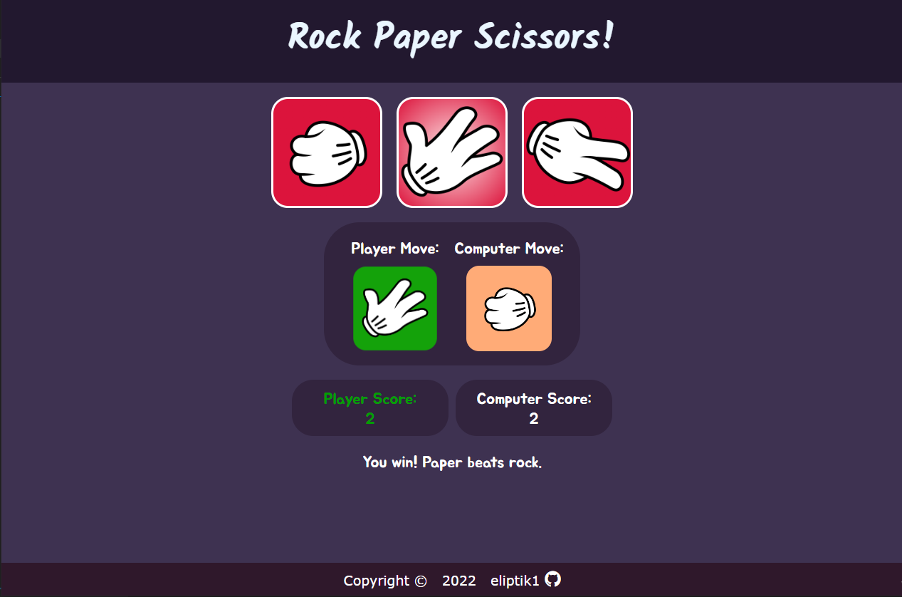

# Rock-Paper-Scissors

This is a basic rock-paper-scissors game created using HTML & CSS and Javascript.

## Technologies Used

- HTML
- CSS
- Javascript
- Git

## Features

- Interactive game where the player chooses between Rock, Paper, and Scissors.
- Animated buttons for Rock, Paper, and Scissors selections.
- Game ends when the player or the computer reaches a score of 5.
- Visual indication of the winner for each round.
- Simple and clean user interface.

## Demo

Check out the live demo: [Rock-Paper-Scissors Demo](https://eliptik1.github.io/rock-paper-scissors/)

## Screenshots

## License

This project is open-source and available under the [MIT License](./LICENSE).